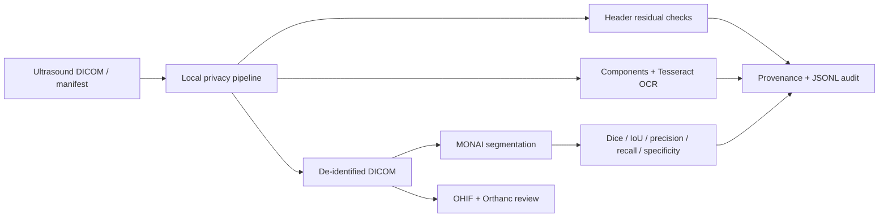
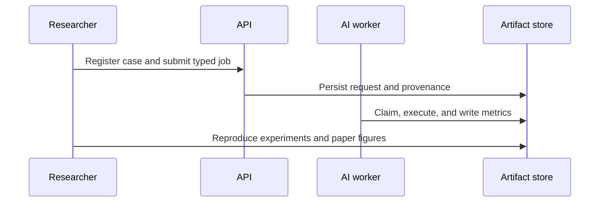
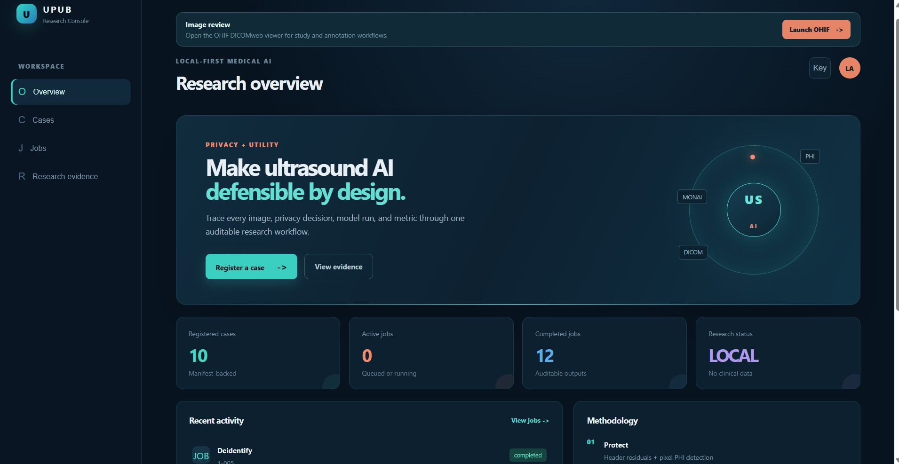
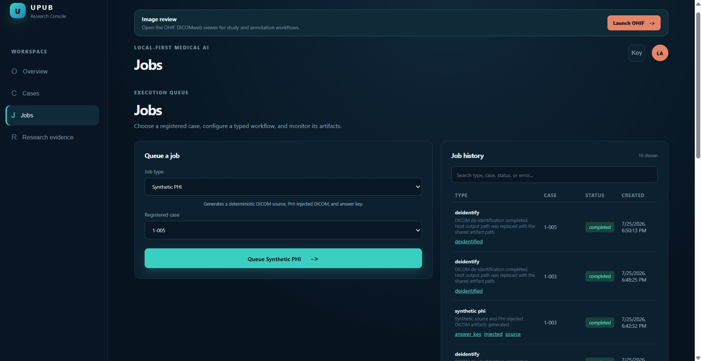
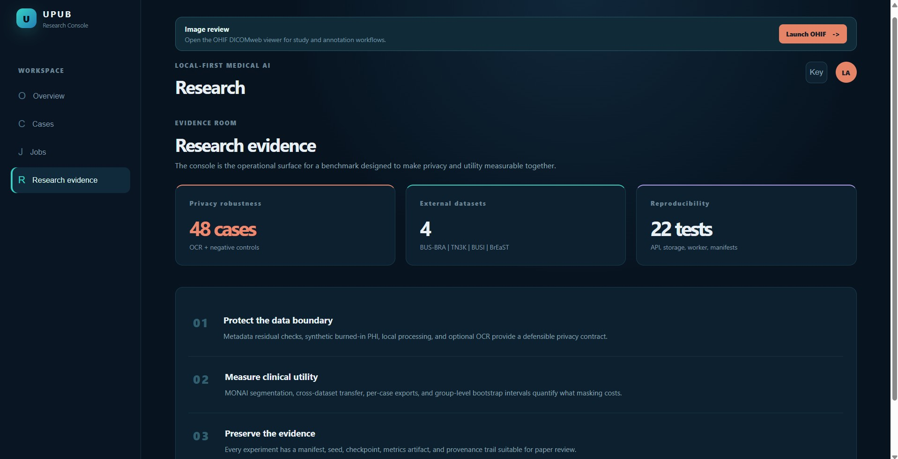
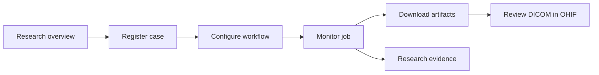
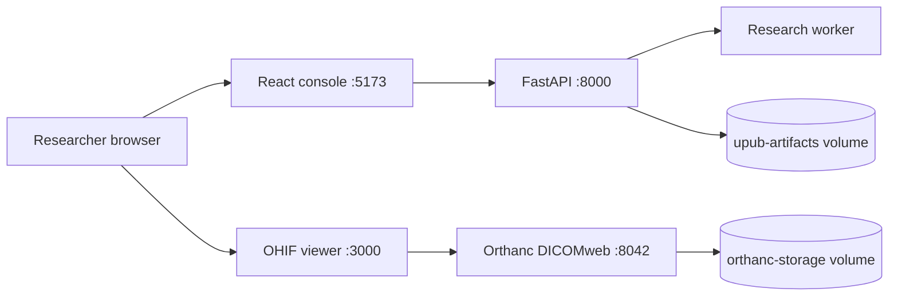
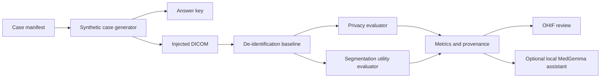

# Ultrasound Privacy Utility Benchmark (UPUB)

UPUB is a privacy–utility benchmark and local review workbench for ultrasound AI.

The project studies whether synthetic PHI can be injected into ultrasound DICOM studies, removed by candidate de-identification pipelines, and evaluated for both privacy success and downstream segmentation utility—without requiring real patient data.

<p align="center">
  
</p>

<p align="center">
  
  
  
  
  
</p>

## What UPUB is about

UPUB is a local-first privacy–utility benchmark and review workbench for
ultrasound AI. It connects synthetic DICOM PHI injection, de-identification,
pixel/OCR evaluation, MONAI segmentation, DICOMweb review, and reproducible
provenance without requiring real patient data.

> Research software only. UPUB is not a clinical device, HIPAA certification,
> or a guarantee that arbitrary burned-in PHI is removed.

## Research questions

1. Can synthetic header and pixel PHI be measured with deterministic ground truth?
2. How much downstream segmentation utility is lost or recovered after masking?
3. How stable are ultrasound segmentation results across datasets and seeds?
4. Which detector limitations appear under contrast, blur, compression, negative
   controls, and OCR variation?





## Research outputs

| Deliverable | Location |
|---|---|
| Markdown manuscript | [`paper/manuscript.md`](paper/manuscript.md) |
| IEEE PDF | [`paper/outputs/upub_ieee.pdf`](paper/outputs/upub_ieee.pdf) |
| Editable DOCX | [`paper/outputs/upub_ieee.docx`](paper/outputs/upub_ieee.docx) |
| Privacy/OCR artifacts | [`artifacts/privacy-robustness-suite/`](artifacts/privacy-robustness-suite/) |
| Production deployment | [`docs/production-deployment.md`](docs/production-deployment.md) |
| Enterprise integration contract | [`docs/enterprise-integration.md`](docs/enterprise-integration.md) |
| SIEM forwarding contract | [`docs/siem-forwarding.md`](docs/siem-forwarding.md) |
| Access governance template | [`docs/access-governance.md`](docs/access-governance.md) |

## Research Console UI gallery

The repository includes representative screenshots in [`console/UI/`](console/UI/)
showing the main local-first workflow: orienting the study, running a typed job,
reviewing generated artifacts, and inspecting the research evidence view.

<table>
  <tr>
    <td align="center" width="33%">
      
      <br /><sub><b>Research overview</b><br />Case inventory, active jobs, completed outputs, and methodology.</sub>
    </td>
    <td align="center" width="33%">
      
      <br /><sub><b>Jobs and artifacts</b><br />Typed workflow execution, status monitoring, and downloadable outputs.</sub>
    </td>
    <td align="center" width="33%">
      
      <br /><sub><b>Research evidence</b><br />Privacy robustness, external datasets, reproducibility, and study methodology.</sub>
    </td>
  </tr>
</table>



## Current milestone

The implementation milestone is complete for controlled research deployment:

- a versioned benchmark manifest contract;
- a FastAPI workflow service;
- executable synthetic-PHI, de-identification, segmentation, and evaluation workers;
- Docker Compose profiles for the core service and optional viewer/assistant services;
- 22 regression tests covering API, storage, privacy, manifests, and worker execution;
- a deterministic synthetic DICOM experiment with pixel/header PHI and an answer key.
- an explainable pixel-PHI detector baseline that exposes the pre-OCR limitation.
- a formal threat model covering headers, burned-in pixels, derived artifacts, and local deployment assumptions.

No real clinical data is required or expected for development.

## Repository size and data boundaries

The Git repository contains source code, configuration, documentation, paper
source, and small reproducibility fixtures. Downloaded datasets and generated
experiment outputs are intentionally excluded from Git through `.gitignore`:

- `data/` — external ultrasound datasets and archives;
- `artifacts/` — generated DICOM files, checkpoints, metrics, and runtime data;
- `models/`, `reports/`, and `papers/` — local research outputs or caches;
- `console/node_modules/` and build directories — reproducible dependencies and
  generated frontend assets.

Install dependencies and download datasets separately using the documented
ingestion scripts. Before publishing, inspect the candidate set with:

```powershell
git status --short
git ls-files --others --exclude-standard
```

Do not force-add clinical data, archives, model weights, runtime artifacts, or
secrets. The paper source and generated submission deliverables under `paper/`
are kept versionable, while the local MiKTeX cache is ignored.

## Quick start

### Full local stack: API, worker, React console, OHIF, and Orthanc

This is the recommended end-to-end development launch. It starts the FastAPI
workflow service, persistent worker, React Research Console, pinned stable OHIF
viewer, and Orthanc DICOMweb archive:

```powershell
docker compose --profile core --profile console --profile viewer up --build -d
```

For rapid UI/API iteration, skip the heavyweight Torch/MONAI worker image:

```powershell
docker compose --profile console --profile viewer up -d
```

The worker is only needed when executing queued AI jobs. Build it separately
when required:

```powershell
docker compose --profile core build worker
```

Docker now caches Python dependency layers independently from application
source changes, including the heavyweight AI dependencies. Normal restarts do
not need `--build`; use `--build console` or `--build api` only after changing
that service.



Open these endpoints:

| Service | URL | Purpose |
|---|---|---|
| React Research Console | `http://localhost:5173` | Health, cases, jobs, research workflow, and OHIF launch link |
| OHIF | `http://localhost:3000` | DICOM study viewing, measurements, annotations, and overlays |
| FastAPI docs | `http://localhost:8000/docs` | Interactive API contract |
| Orthanc | `http://localhost:8042` | DICOM archive and local upload interface |

Verify the stack:

```powershell
Invoke-WebRequest http://localhost:5173 -UseBasicParsing
Invoke-WebRequest http://localhost:5173/api/healthz -UseBasicParsing
Invoke-WebRequest http://localhost:3000 -UseBasicParsing
Invoke-WebRequest http://localhost:8042/dicom-web/studies -UseBasicParsing
```

Upload a de-identified DICOM study for OHIF review:

```powershell
Invoke-WebRequest `
  -Uri http://localhost:8042/instances `
  -Method Post `
  -InFile .\artifacts\demo-case\demo-case.deidentified.dcm `
  -ContentType 'application/dicom'
```

Refresh OHIF at `http://localhost:3000`; the uploaded study should appear in
the worklist. Use the React console's **Import DICOM to OHIF** action for local
file import; it validates DICOM files and sends them to Orthanc before opening
the study browser. The React console's Image review bar opens the same viewer.

Inspect service logs or stop the stack:

```powershell
docker compose --profile core --profile console --profile viewer logs -f api worker console ohif orthanc
docker compose --profile core --profile console --profile viewer down
```

The default Compose volumes are retained by `down` so local studies and
artifacts are not removed. Use `down -v` only when intentionally resetting the
local database and artifact volumes.

For the API-only quick start, use:

```powershell
docker compose --profile core up --build
```

Then open `http://localhost:8000/docs`.

Launch the React research console alongside the API and worker:

```powershell
docker compose --profile core --profile console up --build
```

Then open `http://localhost:5173`. The console provides live health, case
registration, browser-based file/folder intake, job submission, and research evidence views; API calls are
proxied privately through its Nginx container. See
[`console/README.md`](console/README.md) for local Vite development.

For a local Python smoke test:

```powershell
python -m venv .venv
.\.venv\Scripts\Activate.ps1
python -m pip install -e ".[dev]"
pytest
uvicorn us_privbench.api.main:app --reload
```

Run the first benchmark experiment:

```powershell
$env:PYTHONPATH = "src"
python scripts/run_synthetic_case.py
```

The command writes a synthetic source DICOM, an injected DICOM, a de-identified
DICOM, `answer-key.json`, and `metrics.json` under `artifacts/demo-case/`.
The metrics include the transparent connected-component detector's candidate
precision/recall. It is deliberately a pre-OCR control; see
[`docs/threat-model.md`](docs/threat-model.md). An optional Tesseract adapter is
available through `python -m pip install -e ".[ocr]"`, but a pinned native
Tesseract executable and language pack are still required.

The core container stack has been smoke-tested with Docker Desktop: the API
health endpoint, case registration, and job submission all work in containers.
The worker is built separately from `Dockerfile.worker` and includes the
optional CPU MONAI/Torch runtime required for queued segmentation and
test-split evaluation jobs; the API image remains lightweight.

For shared research deployments, set `UPUB_API_KEY` and retain the JSONL
request audit at `UPUB_AUDIT_LOG`. The audit records route metadata and status,
never API keys, request bodies, or clinical payloads. TLS termination and
enterprise identity remain outside this local Compose stack.

Run the optional local imaging workbench:

```powershell
docker compose --profile viewer up -d
```

This starts the pinned stable OHIF application (`ohif/app:v3.12.7`) at
`http://localhost:3000` and Orthanc/DICOMweb at `http://localhost:8042`. The
React console's Image review launch bar opens the same viewer. See
[`viewer/README.md`](viewer/README.md) for the
configuration boundary and local-only security warning.

Run the CPU utility experiment:

```powershell
$env:PYTHONPATH = "src"
python scripts/run_utility_experiment.py
```

This compares segmentation metrics on clean, PHI-injected, and de-identified
synthetic cases. The current threshold segmenter is a sanity baseline; the
research model backend will be a MONAI U-Net selected through the same metric
contract.

To install the optional learned-model dependencies later:

```powershell
python -m pip install -e ".[ai]"
```

Build and run the optional OCR smoke container:

```powershell
docker compose --profile ocr up --build --abort-on-container-exit ocr
```

The container pins the Debian Tesseract package and records OCR-region metrics
alongside the component negative control. It is an experiment boundary, not a
complete claim of pixel-PHI protection.

The persisted canonical OCR result is in
`artifacts/ocr-smoke/metrics.json`: Tesseract achieved precision/recall `1.0/1.0`
on three rendered PHI regions at IoU `0.1`, while the component control achieved
`0.0/0.0`.

## How to use the system

### 1. Start the research stack

```powershell
docker compose --profile core up --build
```

Use `http://localhost:8000/docs` for the API contract. The API and AI worker
share the durable `upub-artifacts` volume.

### 2. Run privacy experiments

```powershell
$env:PYTHONPATH = "src"
python scripts/run_synthetic_case.py
docker compose --profile ocr run --rm ocr python scripts/run_privacy_robustness.py --ocr --output /app/artifacts/privacy-robustness-suite/metrics-ocr.json
```

### 3. Run segmentation experiments

```powershell
$env:PYTHONPATH = "src"
python scripts/train_monai.py artifacts/breast-lesions-usg-manifest.json `
  --epochs 1 --image-size 128 --batch-size 16 `
  --limit-train 100 --limit-validation 40 --limit-test 50 `
  --seed 7 --output artifacts/example-run
```

The training command writes a checkpoint, provenance, per-case test metrics,
and patient/group bootstrap summaries.

### 4. Review DICOM studies

```powershell
docker compose --profile viewer up -d
```

Open OHIF at `http://localhost:3000` and Orthanc at `http://localhost:8042` in
local development. See [`viewer/README.md`](viewer/README.md).

### 5. Deploy the hardened reference stack

Set secrets from `.env.production.example`, then follow
[`docs/production-deployment.md`](docs/production-deployment.md). The overlay
exposes Caddy TLS only; API and Orthanc remain internal.

## Manuscript outputs

The current preliminary paper is maintained separately under `paper/`:

- [`paper/manuscript.md`](paper/manuscript.md)
- [`paper/ieee/main.tex`](paper/ieee/main.tex)
- [`paper/outputs/upub_ieee.pdf`](paper/outputs/upub_ieee.pdf)
- [`paper/outputs/upub_ieee.docx`](paper/outputs/upub_ieee.docx)

The manuscript reports measured artifacts and explicitly labels the rotating
BUS-BRA evaluation as development evidence rather than a locked external test.

Run the bounded architecture comparison:

```powershell
$env:PYTHONPATH = "src"
python scripts/compare_architectures.py artifacts/busbra-fold-1-test-2.json
```

This compares the compact U-Net with an attention-gated U-Net under identical
data, loss, and training settings. It is an intermediate comparator, not a
full reproduction of AAU-Net. The current matched five-fold bounded study also
includes the HAAM implementation through `--architecture aau_net`.

Create a patient-disjoint experiment manifest:

```powershell
$env:PYTHONPATH = "src"
python scripts/build_demo_manifest.py
```

The learned entry point validates the manifest before constructing the MONAI
model:

```powershell
python scripts/train_monai.py artifacts/demo-manifest.json
```

The current demo manifest constructs a compact MONAI U-Net with `401,288`
parameters and reports `train=2`, `validation=1`, `test=1` after the leakage
guard passes. It is a model-construction smoke test; training on a real public
dataset remains the next experiment milestone.

For a real public dataset, create a JSON manifest whose `image_uri` and
`mask_uri` point to local image files and whose `patient_group` values are
patient identifiers. The same command then uses the manifest-backed MONAI
training path instead of synthetic smoke data.

The path can be exercised locally with generated image files:

```powershell
$env:PYTHONPATH = "src"
python scripts/build_demo_image_dataset.py
python scripts/train_monai.py artifacts/demo-image-dataset/manifest.json --epochs 1 --image-size 64 --output artifacts/monai-manifest-run
```

Latest manifest-path smoke result: 3 training cases, 2 validation cases, one
epoch, validation Dice `0.1125`, and a saved checkpoint. The score is not a
quality claim; it is a small-run integration check.

Run the learned CPU smoke experiment:

```powershell
$env:PYTHONPATH = "src"
python scripts/train_monai.py artifacts/demo-manifest.json --synthetic-smoke --epochs 2
```

This trains on deterministic synthetic cases, evaluates on separate synthetic
cases, and writes a checkpoint plus metrics under `artifacts/monai-smoke/`.

Latest smoke result: 4 training cases, 2 validation cases, final loss `1.2984`,
validation Dice `0.8169`. This is an engineering smoke result on generated data,
not a publishable model result.

## Research boundaries

The system is a research and engineering workbench, not a diagnostic device. MedGemma, when enabled, is an optional local review assistant. Deterministic metrics, answer keys, and provenance remain the source of truth.

See [docs/design.md](docs/design.md) for the architecture and the research sequence.
See [docs/threat-model.md](docs/threat-model.md) for the privacy scope, adversary,
trust assumptions, and measurement boundary.
The remaining research and implementation gates are tracked in
[`docs/research-expansion-plan.md`](docs/research-expansion-plan.md). BUS-BRA,
TN3K, and the clearly labeled BUSI-WHU mirror now have audited manifests and
bounded multi-seed results. BUS-UCLM remains blocked by its official download
endpoint, and patient-level external breast validation is still an open
publication gate.

## Architecture at a glance



The benchmark truth is generated before any AI inference. AI models may propose
regions or explanations, but the answer key and deterministic evaluators define
the measured result.

## First real dataset target

The first real training target is [BUS-BRA](https://doi.org/10.5281/zenodo.8231412).
Its published materials describe anonymized breast-ultrasound PNG images,
reference segmentations, patient-level data, and standardized partitions. Obtain
the dataset directly from its official repository, inspect the supplied CSV, and
convert it with the explicit-column ingester:

```powershell
$env:PYTHONPATH = "src"
python scripts/ingest_csv_manifest.py path\to\busbra.csv `
  --root path\to\BUS-BRA `
  --output artifacts\busbra-manifest.json `
  --image-column image `
  --mask-column mask `
  --patient-column Case `
  --split-column K5P `
  --dataset-name BUS-BRA `
  --dataset-version zenodo-8231412
```

The exact column names must be confirmed from the downloaded release. The
ingester refuses missing files, unknown splits, and patient leakage.

For the verified Zenodo v1.0 layout, use the dedicated adapter:

```powershell
$env:PYTHONPATH = "src"
python scripts/ingest_busbra.py data/external/busbra/release/BUSBRA `
  --validation-fold 1 `
  --test-fold 2 `
  --output artifacts/busbra-fold-1.json
```

This creates patient-grouped train/validation/test records from the release's
`kFold` metadata. The validation and test folds are required to be different;
the test fold remains untouched until checkpoint selection is complete.

Run a bounded real-data smoke test before a full training run:

```powershell
$env:OMP_NUM_THREADS = "1"
$env:MKL_NUM_THREADS = "1"
$env:PYTHONPATH = "src"
python scripts/train_monai.py artifacts/busbra-fold-1.json --epochs 1 --image-size 128 --batch-size 2 --limit-train 8 --limit-validation 4 --output artifacts/busbra-real-smoke
```

The verified smoke run used 8 BUS-BRA training views and 4 validation views,
produced a checkpoint, and measured validation Dice `0.1013`. This is a loader
and training-path check, not a model-quality result.

With the explicit test fold enabled, the same bounded run used fold 1 for
validation and fold 2 for test: validation Dice `0.1287`, test Dice `0.2043`,
and a checkpoint selected before test evaluation. These numbers are still only
infrastructure smoke results because the run used 8/4/4 cases and one epoch.

Every MONAI run writes `provenance.json` beside its checkpoint with the manifest
SHA-256, runtime details, and training configuration.

For BUS-UCLM, obtain the official CC BY-NC 3.0 release from its Mendeley record, place
the extracted `images/` and `masks/` folders outside version control, and use:

```powershell
$env:PYTHONPATH = "src"
python scripts/ingest_bus_uclm.py path\to\BUS-UCLM `
  --output artifacts/bus-uclm-manifest.json
python scripts/audit_manifest.py artifacts/bus-uclm-manifest.json
```

The dataset-specific adapter derives patient groups from the published image
prefix convention and keeps the named test patients isolated. Do not report
BUS-UCLM results until the downloaded release and its patient identifiers have
been independently audited.

Training applies synchronized horizontal flips to image/mask pairs. Run the
fold runner for a full-data fold:

```powershell
$env:OMP_NUM_THREADS = "1"
$env:MKL_NUM_THREADS = "1"
$env:PYTHONPATH = "src"
python scripts/run_busbra_cv.py data/external/busbra/release/BUSBRA --folds 1 --test-fold 2 --epochs 2 --image-size 128 --batch-size 8 --output artifacts/busbra-cv
```

The first full fold completed with 1,114 train views, 376 validation views, and
385 untouched test views. After two epochs with augmentation, validation Dice
was `0.5631` and test Dice was `0.5389`. Results and fold provenance are stored
under `artifacts/busbra-cv/`.

First larger bounded BUS-BRA run: 100 training views, 50 validation views, 50
test views, two epochs at 128×128, validation Dice `0.1551`, and test Dice
`0.1824`. This remains a CPU-scale development benchmark, not the final paper
experiment.

Across the five rotating folds, mean test Dice was `0.6074` with sample
standard deviation `0.0590`; mean validation Dice was `0.6086 ± 0.0679`.
These are two-epoch, 128×128 development baselines, not final paper claims.

Bounded loss ablation on the same 100/50/50 split, one epoch: DiceCE produced
test Dice `0.1831`; DiceFocal produced `0.2068`. This is an ablation signal, not
enough evidence to select a final loss.

## External dataset evidence

TN3K is acquired under `data/external/tn3k` and audited by
`scripts/ingest_tn3k.py`; its three-seed bounded U-Net mean test Dice is
`0.3586` (SD `0.0962`). BUSI-WHU-Seg is acquired under
`data/external/busi-whu-seg` as a 927-image mirror with paired masks; its
separate three-seed mean is `0.0960` (SD `0.0311`). Neither release exposes
patient identifiers in the acquired layout, and BUSI-WHU is not claimed as the
canonical BUSI release. See [dataset provenance](docs/dataset-provenance.md).

The zero-shot transfer matrix is also recorded in
`artifacts/zero-shot-transfer-summary.json`: BUS-BRA→TN3K Dice `0.4123`,
BUS-BRA→BUSI-WHU Dice `0.4135`, TN3K→BUS-BRA Dice `0.3140`, and
BUSI-WHU→BUS-BRA Dice `0.2128`. These checkpoints were frozen before target
evaluation; no target fine-tuning or target checkpoint selection was used.

The next external breast target is Breast-Lesions-USG/BrEaST. Place the
official TCIA XLSX and `BrEaST-Lesions_USG-images_and_masks/` folder under a
local data directory, then run:

```powershell
$env:PYTHONPATH = "src"
python scripts/ingest_breast_usg.py path\to\Breast-Lesions-USG `
  --clinical-xlsx path\to\Breast-Lesions-USG\BrEaST-Lesions-USG-clinical-data.xlsx
python scripts/audit_manifest.py artifacts/breast-lesions-usg-manifest.json
```

The adapter excludes rows without tumor masks and preserves `Case_ID` as the
patient-group key. The official TCIA package must be acquired and cited before
any result is promoted into the primary paper.

BrEaST is now acquired and audited under
`data/external/BrEaST-Lesions_USG-images_and_masks-Dec-15-2023`. Its manifest
contains 252 masked cases with 145/55/52 train/validation/test cases. The
three-seed bounded U-Net mean test Dice is `0.1702` (SD `0.0306`), while the
frozen BUS-BRA checkpoint transfers to BrEaST at Dice `0.4583` without target
adaptation. Per-case metrics and patient-group bootstrap intervals are stored
in `artifacts/transfer-busbra-locked-to-breast-usg-patient-ci.json` and
`artifacts/transfer-busbra-locked-to-breast-usg-per-case.json`; the Dice 95%
interval is `[0.4006, 0.5182]` over 50 CaseID groups.

The expanded privacy robustness suite is stored under
`artifacts/privacy-robustness-suite/`. It contains 48 positive and negative
control cases covering contrast, position, scale, blur, and JPEG degradation.
The baseline component detector achieved zero matched positive recall and
produced a mean 37 candidates on negative controls, so these results are
reported as a transparent limitation rather than a production de-identification claim.
