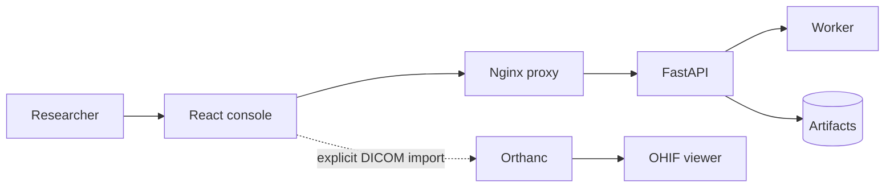

# UPUB Research Console

The React/Vite operational UI integrates with FastAPI for health, case
registration, job submission, and live inventory.

## Local development

```powershell
cd console
npm install
npm run dev
```

Open `http://localhost:5173`. Vite proxies `/api/*` to `http://localhost:8000/*`.

## Case intake workflow

The Cases page supports file and folder selection. Selection calculates a local
summary and suggests a safe case ID; it does not upload contents, absolute
paths, or filenames. The API receives a `browser://...` source descriptor and
manifest summary.

For an explicit DICOM selection, use **Import DICOM to OHIF**. That action
uploads the chosen DICOM files to the local Orthanc archive so OHIF can browse
the resulting study. PNG/JPEG files remain manifest-only because OHIF is a
DICOM viewer. After registration, select the case on Jobs to queue research
workflows.

The **Synthetic PHI** workflow is runnable directly from the console. The
de-identification, segmentation, and evaluation adapters require prepared
worker-visible inputs such as `input_path`, `mask_path`, `manifest`, and
`checkpoint`. The console does not invent or upload those training artifacts;
it disables those actions until a typed workflow configuration is provided.
The API validates these requirements before creating a queue record, so a
misconfigured job fails immediately with an actionable message rather than
remaining queued and failing later.

## Containerized use

From the repository root:

```powershell
docker compose --profile core --profile console up --build
```

For fast frontend/API iteration without the Torch/MONAI worker:

```powershell
docker compose --profile console up -d
```

Open `http://localhost:5173`. Nginx serves the SPA and proxies API calls over
the private Compose network. The optional API key is entered through the
header control and held in memory only.


