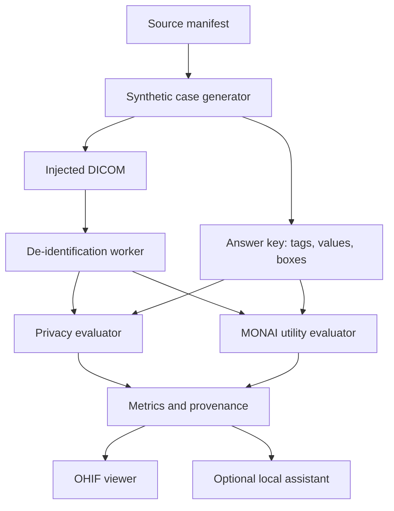
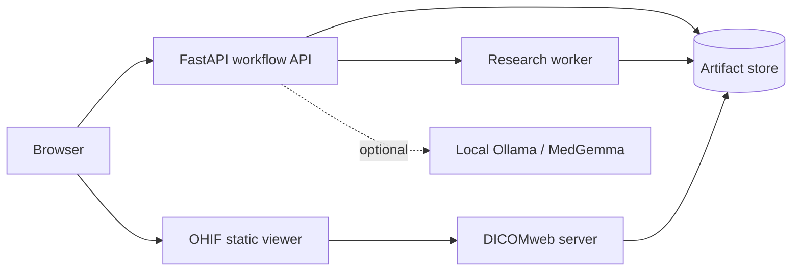
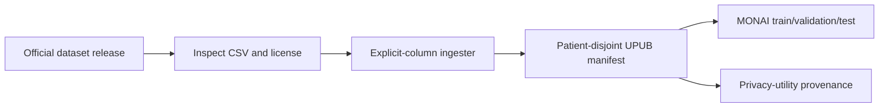
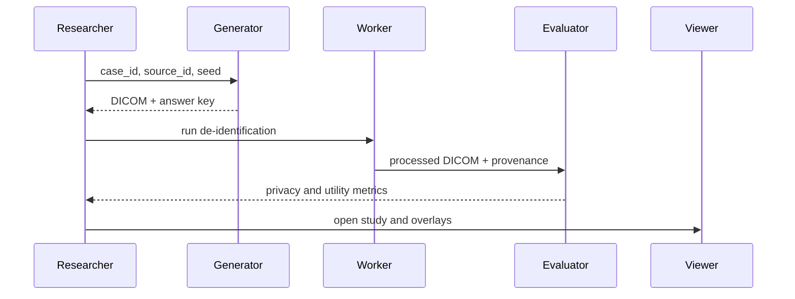
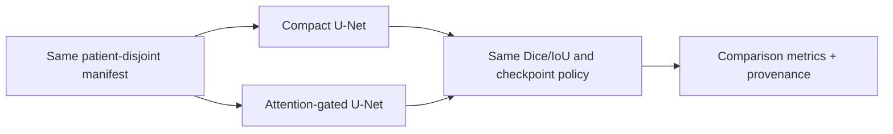

# System design

## Research objective

Measure the privacy–utility tradeoff created by medical-image de-identification on ultrasound workflows.

The first implementation question is deliberately operational:

> Given the same deterministic synthetic case, can we verify removal of PHI from both DICOM metadata and image pixels while measuring whether the output remains useful for tumor segmentation?

## Design principles

1. Synthetic data first. Real PHI is out of scope for development and tests.
2. Manifest first. Every artifact is addressable, versioned, and reproducible.
3. Patient-disjoint evaluation. Splits are asserted, not assumed.
4. Deterministic truth beats generated prose. Assistant output can explain results but cannot define them.
5. Services communicate through stable contracts. OHIF and model runtimes remain replaceable.
6. The React Research Console is a thin operational client; it does not duplicate backend state or vendor OHIF source.
6. Every failed or unsafe case is quarantined with a reason.

## Initial components

| Component | Responsibility | Initial implementation |
|---|---|---|
| `api` | Case registration, job submission, health, provenance | FastAPI |
| `worker` | Synthetic PHI, de-identification, segmentation jobs | Python worker boundary; implementations added incrementally |
| `dicomweb` | DICOM study/series access for OHIF | Optional service profile |
| `ohif` | Image and overlay review | Separately deployed stable OHIF `ohif/app:v3.12.7`, configured over DICOMweb |
| `assistant` | Optional local evidence-grounded review | Ollama/MedGemma profile, not required by core |
| `artifacts` | Manifests, answer keys, metrics, logs, images | Local volume initially; object storage later |

## Data flow

## Deployment topology

OHIF is deliberately deployed as an independent client. The application owns
workflow, metrics, and provenance; OHIF owns image display and annotation tools.

The API supports optional shared-deployment protection through `UPUB_API_KEY`.
When set, the `/v1/*` routes require the matching `X-API-Key` header; health
and readiness probes remain available for orchestration. This is a lightweight
research boundary, not a substitute for TLS, identity management, or an audit
platform.

When `UPUB_AUDIT_LOG` is configured, every `/v1/*` request—including rejected
API-key requests—is appended as one JSON object per line with timestamp, method,
path, and status. Request bodies, API keys, and clinical payloads are never
written to this log.

The core Compose profile runs the API and a persistent worker boundary. The API
persists case/job records under the local artifact root, and the worker claims
queued records and records running/terminal adapter status. Synthetic PHI
generation and DICOM de-identification now execute when the job config includes
`execute=true`; single-case MONAI segmentation also executes when checkpoint,
image, and mask paths are supplied. Dataset-level evaluation remains an
explicit test-split-only batch adapter when a manifest and frozen checkpoint
are supplied through the worker. Job state is persisted idempotently under the
local artifact root. The worker uses `Dockerfile.worker`, which includes the
optional MONAI/Torch runtime while the API image remains lightweight.

## First API contract

`POST /v1/cases` registers a case manifest. The API validates that the case has a stable ID, source reference, dataset version, and patient group. It does not accept raw image bytes yet; files will be attached through an artifact store in the next milestone.

`POST /v1/jobs` creates a typed job (`synthetic_phi`, `deidentify`, `segment`, or `evaluate`) referencing a registered case. The worker executes a job when `config.execute=true` and the required input paths/checkpoint are supplied, then records artifact paths and metrics.

`GET /v1/jobs/{job_id}` returns status and provenance. Dataset-level evaluation
is test-split-only and never uses target data for training or checkpoint
selection.

`GET /healthz` is a liveness check and `GET /readyz` is a readiness check.

## AI use that adds research value

- Use MONAI for the segmentation baseline and controlled ablations.
- Use a learned PHI detector only after a deterministic/OCR baseline exists.
- Use MedGemma as an optional local assistant for structured case review, failure summaries, and provenance navigation.
- Evaluate assistant accuracy against answer keys and deterministic metrics; do not use it as a source of ground truth.
- Record model name, version, prompt/template version, input artifact IDs, and output schema for every assistant result.

## Planned storage boundary

The local API uses a file-backed artifact repository with explicit classes:

- `source/` — public source assets;
- `synthetic/` — generated DICOM and image artifacts;
- `processed/` — de-identified outputs;
- `truth/` — answer keys and masks;
- `metrics/` — immutable evaluation outputs;
- `quarantine/` — rejected cases and reasons.

Never overwrite source artifacts. Binary objects are content-addressed and job
outputs are written under a run ID. This local store is not a production
database and must be replaced or hardened for shared sensitive-data use.

## Implemented experiment slice

The synthetic module now creates a deterministic ultrasound-like grayscale fixture,
writes valid single-frame DICOM files, injects synthetic values into both headers
and a top-left pixel banner, and emits the exact overlay boxes and DICOM tags in
an answer key. The baseline de-identifier clears the target fields and masks the
known pixel regions. Its evaluator reports residual header count and whether all
pixels outside the planted PHI regions remain identical to the source image.

This is intentionally a transparent oracle baseline. The next research step is
to replace the known-box input with OCR and then a learned pixel-PHI detector,
while retaining the same answer key and evaluator.

## Utility contract

The segmentation backend receives a grayscale pixel array and a binary truth
mask, then returns at least Dice, IoU, predicted foreground size, and truth
foreground size. The current CPU threshold implementation is only a pipeline
sanity check. The MONAI adapter will implement the same contract with a
patient-disjoint train/validation/test protocol and checkpoint provenance.

The MONAI dependency is optional (`pip install -e ".[ai]"`) so lightweight
privacy experiments do not require a deep-learning runtime. The adapter uses a
compact 2D U-Net as the first learned baseline; training code will be added only
after public dataset manifests and patient-grouped folds are wired in.

The demo manifest has been verified against the MONAI adapter: it constructs a
401,288-parameter U-Net after confirming the train/validation/test patient groups
are disjoint.

The CPU smoke trainer now exercises the actual MONAI loss, optimizer, forward
pass, validation Dice calculation, and checkpoint write. Its synthetic cases are
only infrastructure fixtures; they are not evidence of clinical performance.

The latest two-epoch smoke run completed with final loss `1.2984`, validation
Dice `0.8169`, and a saved checkpoint. The next change should replace only the
dataset adapter and experiment configuration; the training/evaluation contract
should remain unchanged.

The demo image-dataset generator exercises this exact manifest-backed path with
PNG images and masks. It is a fixture for validating code and split handling,
not a substitute for a licensed clinical dataset.

The latest one-epoch manifest-path smoke run completed with validation Dice
`0.1125` and a saved checkpoint. This low score is expected from the tiny
fixture and short training budget; only the execution path is being validated.

## BUS-BRA ingestion policy

BUS-BRA is the first real dataset target because its official project identifies
an open Zenodo release and documents anonymized PNG images, reference
segmentations, patient-level data, and standardized partitions. The project must
retain the required dataset citation and release identifier in experiment
metadata. No download is performed automatically: the researcher accepts the
dataset terms, places it outside version control, inspects its CSV columns, and
invokes `scripts/ingest_csv_manifest.py` with explicit mappings.

The verified BUS-BRA archive contains `Images/`, `Masks/`, `bus_data.csv`, and
`5-fold-cv.csv`. The dedicated adapter maps `Case` to `patient_group`, selects
one `kFold` as validation, and keeps all other cases in training. This is a
second `kFold` as test, and keeps the remaining cases in training. The test fold
is not used for checkpoint selection.

The bounded real-data smoke run used 8 BUS-BRA training views and 4 validation
views at 128 pixels for one epoch. It saved a checkpoint and measured Dice
`0.1013`; this validates ingestion and execution, not clinical model quality.

The separate-test smoke protocol used BUS-BRA fold 1 for validation and fold 2
for test. After one epoch on bounded subsets, it reported validation Dice
`0.1287` and test Dice `0.2043`; test evaluation occurred after checkpoint
selection. The tiny subset and one-epoch budget make these engineering checks,
not scientific performance claims.

Training outputs also include `provenance.json`, binding the checkpoint to the
manifest SHA-256, runtime, and experiment configuration.

The first larger bounded run used 100/50/50 BUS-BRA views for train/validation/
test and two epochs at 128×128. It produced validation Dice `0.1551` and test
Dice `0.1824`. The result establishes a reproducible baseline and exposes the
need for longer training, augmentation, and full-data evaluation.

The training dataset now applies synchronized horizontal flips. The BUS-BRA
cross-validation runner materializes one manifest per fold, preserves the
patient-grouped protocol, and writes fold-specific checkpoints and metrics.

The first full fold used 1,114/376/385 train/validation/test views at 128×128
for two epochs. It achieved validation Dice `0.5631` and untouched test Dice
`0.5389`; these are the first meaningful BUS-BRA baseline numbers, but still
require multi-fold confidence intervals and ablations before publication.

Across the five rotating folds, mean test Dice was `0.6074 ± 0.0590` and mean
validation Dice was `0.6086 ± 0.0679` using sample standard deviation. The
aggregate is stored in `artifacts/busbra-cv-rotating/aggregate-results.json`.

The aggregator reports approximate 95% t-intervals using the five fold scores.
A bounded one-epoch loss ablation on the same split produced test Dice `0.1831`
with DiceCE and `0.2068` with DiceFocal; both remain exploratory.

The local image adapter uses EXIF correction, bilinear interpolation for images,
and nearest-neighbor interpolation followed by binarization for masks. This is
important for ultrasound collections with mixed resolutions and prevents label
interpolation from creating artificial foreground values.

The manifest layer now rejects any patient group appearing in multiple splits.
This check runs before model construction, so a leakage-prone experiment fails
early instead of producing an invalid validation result.

## Experiment lifecycle

## Architecture comparison milestone

The training contract now accepts `unet` and `attention_unet`. The latter is a
compact MONAI attention-gated U-Net comparator inspired by the attention-U-Net
family; it is explicitly not a full AAU-Net reproduction. On the bounded
100/50/50 BUS-BRA subset at 128×128 for one epoch with DiceCE and augmentation,
compact U-Net test Dice was `0.4657`, attention-gated U-Net test Dice was
`0.3217`, and AAU-Net-style HAAM test Dice was `0.1785` in a single bounded
split. The matched five-fold bounded study produced mean test Dice `0.3713 ±
0.0509` for compact U-Net and `0.1617 ± 0.0261` for HAAM. These remain
development-budget comparisons, not claims about the best possible model.

