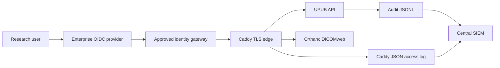

# Enterprise integration contract

This document defines the interfaces that an organization must connect. It is
deliberately provider-neutral: Okta, Entra ID, Keycloak, Auth0, and other OIDC
providers can satisfy the same contract after security review.

## Identity provider contract

The gateway must validate OIDC issuer, audience, signature, nonce, expiry,
redirect URI, and group claims. It must forward only verified identity claims.
UPUB must not be exposed directly to the network when trusting gateway headers.

Required groups:

| Group | Permitted scope |
|---|---|
| `upub-research-reader` | Read approved studies, metrics, and paper artifacts |
| `upub-research-operator` | Submit jobs and manage experiment artifacts |
| `upub-data-steward` | Register datasets, approve provenance, manage retention |
| `upub-security-admin` | Rotate secrets, inspect audit delivery, manage edge policy |

Default deny applies when a user has no approved group. Clinical diagnosis,
bulk export, and deletion of regulated source data are not granted by UPUB.

## Certificate authority contract

- Use ACME only when the organization approves public certificate issuance.
- For private deployments, mount organization-issued certificates through
  Docker secrets and use `deploy/Caddyfile.enterprise.example`.
- Enforce TLS 1.2+, certificate renewal monitoring, and revocation response.
- Never store private keys in Git, images, Compose files, or artifacts.

## Acceptance checks

1. An unrecognized identity receives `401` or `403`.
2. A reader cannot submit jobs or access Orthanc administration.
3. An operator cannot change retention or identity policy.
4. Every API and DICOMweb request has a correlation ID and reaches the SIEM.
5. Secret rotation succeeds without rebuilding images.
6. Certificate expiry alerts fire before the organization’s defined threshold.
7. Quarterly access recertification has an accountable owner and recorded result.
