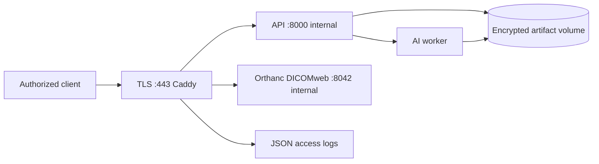

# Production reference deployment

The production Compose overlay provides a hardened reference topology. It is
appropriate for a controlled research environment after organizational review;
it is not a clinical certification or a substitute for a hospital security
assessment.



## Deployment

1. Copy `.env.production.example` to a secret-managed environment file and
   replace every placeholder with long random values. Do not commit it.
2. Set `UPUB_DOMAIN` to a DNS name pointing at the host. Caddy obtains and
   renews a public certificate through ACME when ports 80/443 are reachable.
   For an isolated site, configure an organization-issued certificate instead.
3. Start the overlay:

```powershell
docker compose -f compose.yaml -f compose.production.yaml --profile production up -d
```

4. Verify `https://$env:UPUB_DOMAIN/healthz`, `readyz`, API-key rejection
   without `X-API-Key`, successful authenticated API access, and Orthanc
   DICOMweb access through the proxy.

## Required organizational controls

- Store `.env` values in a secret manager and rotate API/Orthanc credentials.
- Encrypt Docker volumes and backups at rest; define retention and deletion.
- Forward Caddy and `audit.jsonl` to a protected central logging system.
- Restrict host, Docker socket, DNS, and backup administration.
- Pin optional image digests in the organization’s registry mirror after the
  approved OHIF/Orthanc/Caddy versions are selected.
- Complete penetration testing, vulnerability scanning, and clinical/privacy
  governance before handling real patient data.
