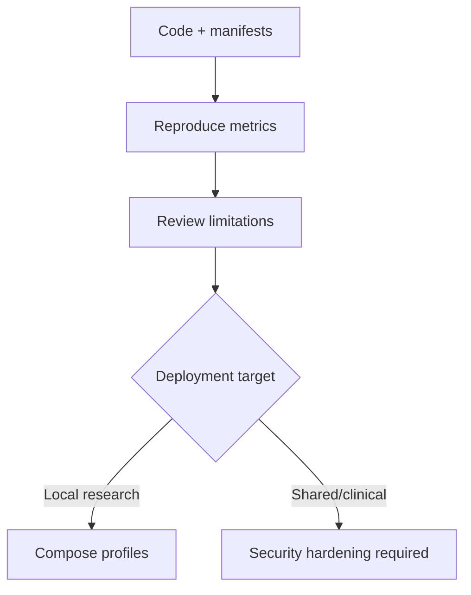

# Release checklist

## Research reproducibility

- [x] Patient-disjoint manifest contract and validation
- [x] Deterministic synthetic DICOM case and answer key
- [x] MONAI U-Net training path with checkpoint and provenance
- [x] BUS-BRA ingestion with rotating five-fold evaluation
- [x] Aggregate metrics with uncertainty interval
- [x] Loss ablation recorded
- [x] Limitations and non-clinical status documented
- [x] Formal privacy threat model and pre-OCR pixel detector metrics documented
- [x] External breast mirror evaluated with an explicit non-patient-ID caveat
- [x] BrEaST/ Breast-Lesions-USG acquired with CaseID-based patient grouping
- [x] BrEaST bounded three-seed baseline and BUS-BRA zero-shot external test
- [x] Cross-anatomy TN3K stress-test baseline evaluated
- [x] External breast dataset with verified CaseID-based patient-level split evaluated
- [x] Consolidated four-dataset three-seed statistics with bootstrap intervals
- [x] Patient-group bootstrap intervals for locked BUS-BRA to BrEaST transfer
- [x] Per-case exports and patient-group bootstrap intervals for three-seed TN3K, BUSI-WHU, and BrEaST reruns
- [x] Three-seed final statistics and group-level confidence intervals (verified patients where identifiers exist; proxy groups labeled)
- [x] Privacy variation suite with OCR and negative controls
- [x] Pinned Tesseract OCR baseline on the canonical synthetic PHI case
- [x] Expanded privacy variation suite with low contrast, blur/JPEG, spatial/scale changes, and negative controls
- [x] Idempotent worker and durable artifact store
- [x] Optional OCR container with pinned Tesseract binary and language data
- [x] Worker executes synthetic generation and DICOM de-identification jobs
- [x] Worker executes single-case queued MONAI segmentation jobs end-to-end
- [x] Worker executes dataset-level test evaluation jobs end-to-end

## Deployment surface

- [x] API and worker Docker services
- [x] Optional upstream OHIF container configuration
- [x] Optional Orthanc DICOMweb service
- [x] Optional Ollama service boundary
- [x] Pin production Caddy and Orthanc image digests; OHIF remains an optional viewer profile
- [x] Reference authentication, TLS, audit logging, and internal-service boundary validated
- [ ] Integrate enterprise identity, certificate policy, centralized logging, and access governance
- [x] Enterprise OIDC, certificate, SIEM, RBAC, and governance integration contracts documented
- [x] Optional API-key guard for `/v1/*` routes in shared research deployments
- [x] Optional JSONL audit log for `/v1/*` requests without request-body capture
- [x] Production Compose overlay with TLS reverse-proxy boundary and internal services
- [x] Secret-required API and Orthanc credentials in production overlay

