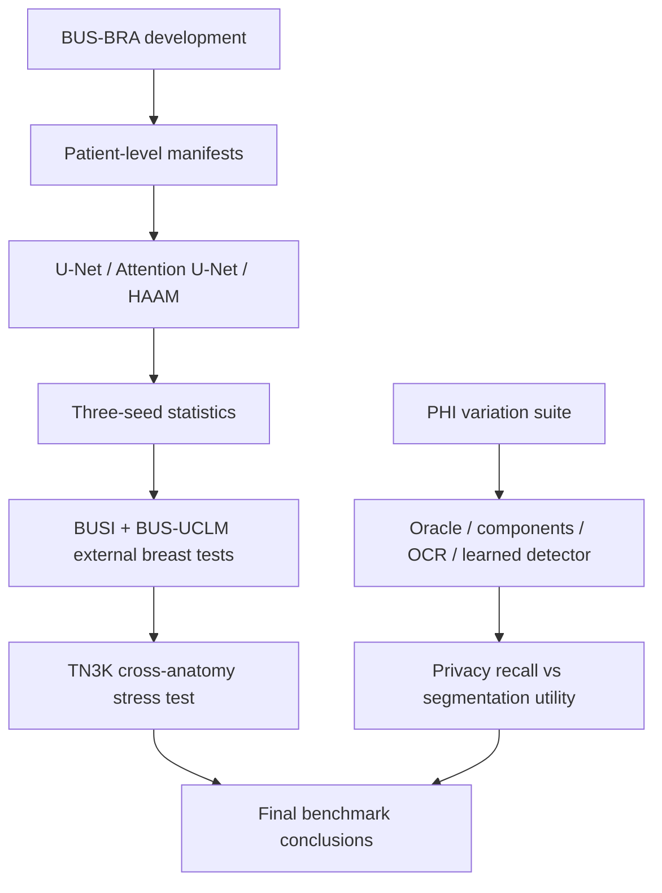

# Research expansion plan

## Honest status

UPUB is not yet a completed research system or publication-ready validation
study. The implemented core is a reproducible engineering baseline: synthetic
DICOM privacy ground truth, patient-disjoint BUS-BRA ingestion, MONAI training,
architecture comparison, Docker boundaries, OHIF/Orthanc configuration, and
publication artifact generation. Several original design items remain open and
must be completed before claiming a full implementation.

## Dataset strategy

| Role | Dataset | Rationale | Required caution |
|---|---|---|---|
| Primary development | BUS-BRA | 1,875 images from 1,064 patients, lesion masks, pathology/BI-RADS metadata, and standardized folds | Preserve official patient grouping and folds |
| External breast validation | BUSI | Widely used 780-image breast-ultrasound segmentation collection | Patient identity/grouping and mask conventions must be audited before splitting |
| External breast shift | BUS-UCLM | 683 images from 38 patients, including normal, benign, and malignant cases with expert masks | Very small patient count; split by patient, never by image |
| Cross-anatomy stress test | TN3K | 3,493 thyroid-nodule images with pixel labels and patient-disjoint partitions | This is a domain-shift experiment, not a breast-tumor result |
| Optional benchmark reference | BUSIS/BUS-Set | Useful for comparing against published breast-ultrasound segmentation protocols | Confirm current access, license, and exact image/mask release |

The minimum publishable multi-dataset study is BUS-BRA development plus one
external breast dataset. BUS-UCLM is attractive because its patient grouping is
explicit, but its small number of patients makes uncertainty wide. BUSI should
be added only after the source grouping and mask semantics have been verified.
TN3K should be reported separately as a generalization stress test, not pooled
with breast datasets.

## Required experiment matrix

### E1: Strong segmentation baselines

Run compact U-Net, Attention U-Net, and the HAAM-style comparator with the same
preprocessing, augmentations, optimizer, loss, epoch budget, and patient-level
protocol on each dataset. Add a published-strength reference such as nnU-Net
or a carefully documented MONAI UNet baseline when compute permits. Report
parameter count, training time, inference time, Dice, IoU, precision, recall,
specificity, and boundary distance (HD95 or surface Dice where masks support it).

### E2: Statistical robustness

Use fixed seeds plus at least three independent seeds for the final comparison,
bootstrap confidence intervals at the patient level, and paired per-patient
comparisons. Do not use a single bounded run as evidence of architectural
superiority. Report missing/empty-mask cases separately.

### E3: External generalization

Train on BUS-BRA and evaluate without adaptation on BUSI and BUS-UCLM. Then
reverse the direction where sample size permits. Compare within-dataset and
cross-dataset degradation, with acquisition/device metadata used for subgroup
analysis when available.

### E4: Privacy benchmark expansion

Generate a controlled pixel-PHI suite varying text position, contrast, font
scale, rotation, overlap with anatomy, compression, and image modality style.
Include negative controls containing non-PHI labels. Compare known-box oracle,
connected components, pinned Tesseract OCR, and a learned detector. Measure
region precision/recall, text-level recall, false-negative rate, mask area, and
segmentation utility loss at matched privacy recall.

### E5: Ablations and failure analysis

Measure the effect of de-identification on segmentation under no mask,
conservative mask, exact mask, over-mask, and under-mask conditions. Stratify
by lesion size, image quality, contrast, and dataset. Preserve failure montages
and per-case metrics rather than reporting only means.

### E6: Reproducible deployment

Harden the idempotent job executor and durable artifact store for shared use.
Pin OHIF/Orthanc image digests, add authentication/TLS/audit
controls for shared deployments, and run a security test that verifies logs,
caches, thumbnails, and checkpoints do not contain source PHI.

## Contribution target

The strongest defensible contribution is not “a new attention model.” It is a
privacy--utility benchmark for ultrasound AI that makes three things jointly
reproducible: (1) controlled pixel and metadata PHI ground truth, (2)
patient-disjoint segmentation utility, and (3) cross-dataset generalization
under explicit threat and artifact contracts. A model contribution should be
added only if it wins against strong baselines across multiple datasets and
seeds with uncertainty intervals.

## Current execution evidence

The first three-seed bounded BUS-BRA U-Net execution is now recorded in
`artifacts/busbra-three-seed-summary.json`: test Dice values were 0.2433,
0.1947, and 0.1695, with mean 0.2025, sample SD 0.0375, and a bootstrap
interval [0.1695, 0.2433]. These are deliberately short development runs and
should not be compared directly with the longer locked result.

The pinned OCR container also completed the canonical synthetic case: Tesseract
achieved precision and recall of 1.0 at IoU 0.1 for the three planted regions.
This is only a controlled smoke test; the 32-case variation suite remains the
required robustness benchmark.

TN3K is now acquired, ingested, and audited through `scripts/ingest_tn3k.py`.
Three bounded seeds produced test Dice 0.4328, 0.3929, and 0.2500 (mean
0.3586, SD 0.0962). BUSI-WHU-Seg is also acquired as a separate public mirror
and audited through `scripts/ingest_busi_whu.py`; three bounded seeds produced
0.1318, 0.0807, and 0.0755 (mean 0.0960, SD 0.0311). These are domain-stress
results, not patient-level external validation, because the acquired releases
do not expose patient identifiers.

The zero-shot transfer runner `scripts/evaluate_checkpoint.py` now evaluates
frozen source checkpoints on a different target manifest. The four-direction
matrix is stored in `artifacts/zero-shot-transfer-summary.json`: BUS-BRA to
TN3K `0.4123`, BUS-BRA to BUSI-WHU `0.4135`, TN3K to BUS-BRA `0.3140`, and
BUSI-WHU to BUS-BRA `0.2128` Dice. No target data was used for training or
checkpoint selection.

## Completion gates

The project should not be labeled complete until the worker, durable artifact
store, OCR container, multi-dataset protocol, independent-seed statistics,
external validation, security hardening, and final paper rebuild are complete.
