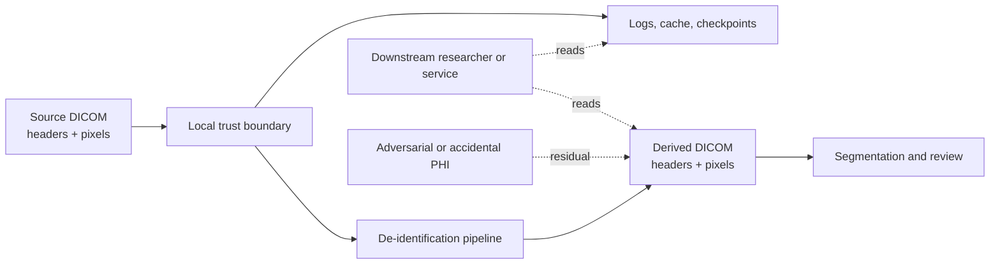

# UPUB threat model

UPUB evaluates a narrow, reproducible privacy claim: a local de-identification
pipeline should remove selected DICOM header values and controlled burned-in
text while preserving clinical pixels outside the protected region. It is not a
certification of HIPAA compliance, a complete DICOM conformance profile, or a
guarantee that arbitrary real-world PHI is removed.

## Assets

- DICOM identifiers and dates in headers.
- Rendered PHI in image pixels, including text with variable contrast,
  position, scale, and overlap with anatomy.
- Derived DICOM files, thumbnails, segmentation outputs, logs, caches, and
  model checkpoints that may indirectly retain source information.
- Privacy and utility metrics, answer keys, and provenance needed to audit a
  run.

## Adversary and trust assumptions

The baseline adversary is a downstream consumer who can inspect a produced
DICOM object and its associated artifacts, but does not modify the running
container. Accidental leakage through preprocessing, logging, caching, or
derived exports is in scope. A malicious host administrator, compromised
container runtime, membership inference, reconstruction attacks, and network
intrusion are out of scope for the current benchmark.

Development assumes a single-user local machine with synthetic data. A shared
deployment requires explicit authentication and authorization, TLS, audit
logging, encrypted storage, retention/deletion policy, network segmentation,
and review of every derived artifact. Docker isolation is an operational
boundary, not a security proof.

## Threat cases and controls

| Threat | Current control or measurement | Status |
|---|---|---|
| Selected header values remain | Exact residual-field count in the synthetic answer key | Measured |
| Controlled bright banner text remains | Known-box masking plus component precision/recall | Measured baseline |
| Low-contrast, shifted, scaled, blurred, or compressed text is missed | 48-case controlled robustness suite with negative controls | Measured for the component baseline; rotation/anatomy overlap remain open |
| False-positive masking damages clinical utility | Pixel preservation outside PHI and segmentation Dice/IoU | Partially measured |
| Logs/cache/checkpoints retain PHI | Artifact inventory and local-only policy | Process control; not automated |
| Optional OCR output changes across environments | Pin Python package, Tesseract binary, language pack, and configuration | Canonical and 48-case variation baselines measured |

The connected-component detector is intentionally a transparent control. The
expanded suite produced zero matched region recall on its positive cases and
many candidates on negative controls, demonstrating why it must not be
described as production burned-in-PHI detection. It is not OCR and the
optional `pytesseract` adapter provides an integration seam; it is only
reproducible once the native Tesseract executable and language data are pinned
in a container or experiment image.

## Metrics

Privacy metrics are header residual count and candidate-region precision and
recall at a documented IoU threshold. Utility metrics are clinical-pixel
preservation outside the answer-key region and segmentation Dice, IoU,
precision, recall, and specificity. Every reported result should include the
fixture seed, detector configuration, model architecture, data split, and
software/runtime provenance.

## Research boundary

The publishable claim supported by the current implementation is a reproducible
privacy–utility evaluation contract with controlled ground truth. The next
research increment is a multi-condition pixel-PHI benchmark: rendered text
variation, negative controls, OCR baselines, learned detectors, masking error
analysis, and external validation with qualified privacy/clinical review.
The pinned OCR container provides a reproducible Tesseract baseline. On the
canonical synthetic case it achieved precision and recall of 1.0 at IoU 0.1,
while the component control achieved 0.0/0.0. This is not sufficient to
establish robustness across contrast, scale, rotation, compression, and
anatomy overlap.
