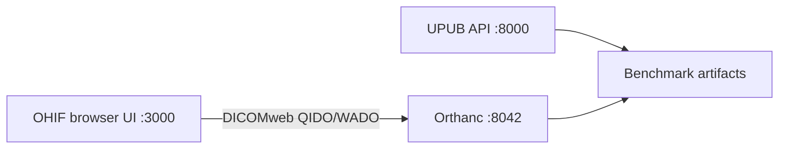

# OHIF integration

The viewer profile runs upstream OHIF and Orthanc as separate containers. The
repository owns only the small runtime configuration in `app-config.js`; it
does not copy OHIF source code into UPUB. The Compose profile pins the current
stable `ohif/app:v3.12.7` image.



Start it with:

```powershell
docker compose --profile viewer up -d
```

Open `http://localhost:3000`. The Study List browses studies already stored in
Orthanc. Import local DICOM files from the UPUB Research Console's **Import
DICOM to OHIF** action; this avoids relying on an unstable runtime upload
customization in the pinned upstream image. Refresh the OHIF Study List after
import. The React Research Console at `http://localhost:5173` also exposes an
Image review launch bar linking to OHIF. This local profile disables Orthanc
authentication; use the production Caddy boundary and institutional controls
before shared or clinical deployment.

The viewer container reverse-proxies `/dicom-web/` and `/wado/` to Orthanc so
the browser uses one origin. This is required because Orthanc does not provide
built-in CORS; the same-origin proxy avoids exposing Orthanc directly to the
browser.
